# Projeto Hydra: Pipeline de Dados Híbrido com Azure e Databricks

***

## 🎯 Visão Geral do Projeto
Este projeto implementa um pipeline de dados de ponta-a-ponta na nuvem **Azure**, com foco em processamento **híbrido (streaming e batch)**. O objetivo foi aplicar as melhores práticas de engenharia de dados utilizando uma stack moderna, com **Azure Databricks** para processamento com **PySpark**, **Delta Lake** como camada de armazenamento Lakehouse, e **Azure Functions** para ingestão serverless.

Este repositório serve como um portfólio prático, demonstrando competências em **arquitetura de dados**, processamento distribuído, qualidade de dados e **práticas de DevOps** para automação e orquestração de pipelines.

***

## 🛠️ Ferramentas e Tecnologias
| Ferramenta | Propósito |
| :--- | :--- |
| **Azure Functions** | **Ingestão Serverless:** Executa um produtor de eventos agendado para simular um fluxo contínuo de dados. |
| **Azure Event Hubs** | **Buffer de Streaming:** Serviço de mensageria que recebe o fluxo de dados e o disponibiliza para consumo. |
| **Azure Data Lake Gen2**| **Data Lakehouse:** Camada de armazenamento para as tabelas Delta nas camadas `raw`, `core` e `analytics`. |
| **Azure Databricks** | **Plataforma Unificada:** Ambiente para desenvolvimento, execução e orquestração de todo o pipeline com PySpark. |
| **Delta Lake** | **Camada de Armazenamento:** Formato de tabela que garante transações ACID, confiabilidade e performance ao Data Lake. |
| **PySpark** | **Processamento:** Utilizado para todas as transformações, incluindo **Streaming Estruturado** e lógicas avançadas com **Window Functions**. |
| **PyDeequ** | **Qualidade de Dados:** Framework para definir e executar testes de qualidade de dados de forma declarativa sobre os DataFrames. |
| **Databricks Jobs & Bundles**| **Orquestração & DevOps:** Automação do pipeline (DAG) e definição da infraestrutura do Job como código (`databricks.yml`). |
| **Git & GitHub** | **Versionamento:** Sistema para versionamento de todo o código do projeto, incluindo notebooks e definições de job. |

***

## 🏗️ Arquitetura da Solução
A solução utiliza uma arquitetura híbrida, onde um caminho batch enriquece os dados que são processados em tempo real pelo caminho de streaming. A orquestração é gerenciada pelo Databricks Jobs, seguindo a arquitetura **Medallion**.

```mermaid
graph TD
    subgraph Azure Cloud
        direction LR
        subgraph Ingestão Serverless
            A[Azure Function] -- Gera lote de transações a cada 5 min --> B[Azure Event Hubs];
        end
        
        subgraph Databricks [Plataforma de Dados]
            direction TB
            
            subgraph Pipeline de Ingestão [Streaming]
                B -- Lê Stream --> C{Notebook 01: Ingestion};
            end

            subgraph Pipeline de Alertas [Streaming]
                F[Core Layer: Perfis] -- Join Estático --> G{Notebook 02: Real-Time Alerts};
            end

            subgraph Pipeline de Perfis [Batch - Job Diário]
                 E -- Lê Batch --> D{Notebook 03: Profiling};
            end
            
            subgraph Pipeline de Qualidade [Batch]
                H[Analytics Layer: Alertas] -- Lê Batch --> I{Notebook 04: Quality Checks};
            end

            C -- Salva Stream --> E[Raw Layer: Transações];
            D -- MERGE --> F;
            E -- Lê Stream --> G;
            G -- Salva Stream --> H;
        end
    end

    style A fill:#722bd1,stroke:#333,stroke-width:2px,color:#fff
    style B fill:#0078D4,stroke:#333,stroke-width:2px,color:#fff
    style E fill:#add8e6,stroke:#333,stroke-width:2px,color:#000
    style F fill:#ff7f50,stroke:#333,stroke-width:2px,color:#000
    style H fill:#3cb371,stroke:#333,stroke-width:2px,color:#000
```

* **Raw (Bronze):** Um pipeline de streaming (`01_ingestion`) consome os dados do Event Hubs e os salva em formato Delta, criando uma cópia fiel da origem.
* **Core (Silver):** Um pipeline batch (`03_profiling`) roda diariamente, lendo os dados da camada `raw` para calcular e atualizar os perfis de comportamento de cada usuário, salvando-os na camada `core`.
* **Analytics (Gold):** Um segundo pipeline de streaming (`02_alerts`) lê as novas transações da camada `raw`, as enriquece em tempo real com os perfis da camada `core` (**stream-table join**) e salva os resultados na camada `analytics`.

***

## ✨ Destaques de Engenharia com PySpark

* **Engenharia de Features com Window Functions:** Para enriquecer os perfis de usuário, foi utilizada uma **Window Function** (`lag`) no PySpark para calcular o tempo decorrido entre as transações de um mesmo usuário. Essa métrica (`avg_time_between_tx_sec`) demonstra a aplicação de técnicas avançadas de transformação para criar features analíticas complexas.
* **Processamento de Streaming com Joins:** A lógica de enriquecimento em tempo real foi implementada através de um **join de stream-tabela**, uma técnica do Streaming Estruturado que cruza um fluxo de dados contínuo com uma tabela de dados estática (os perfis de usuário) para adicionar contexto a cada evento.

***

## ✅ DevOps e Qualidade de Dados

* **Qualidade de Dados com PyDeequ:** A confiabilidade do pipeline foi garantida com a biblioteca **PyDeequ**. Foi implementado um conjunto de testes declarativos que rodam como a etapa final do Job, validando a integridade dos dados na camada `core` (unicidade, valores não-negativos, etc.).
* **Orquestração como Código (Jobs as Code):** Todo o pipeline, incluindo a sequência de tarefas **(DAG)**, a configuração dos clusters e o agendamento, é definido como código em um arquivo **`databricks.yml`**. Esta abordagem de **Jobs as Code** com Databricks Asset Bundles permite que a orquestração seja versionada no Git e implantada de forma automatizada com a **Databricks CLI**, garantindo consistência e reprodutibilidade.
* **Segurança e Governança:** A comunicação entre Databricks e Data Lake é autenticada via **Microsoft Entra ID (Service Principal)**, seguindo o **Princípio do Menor Privilégio** com papéis RBAC específicos. Segredos são gerenciados de forma segura no **Azure Key Vault**.

***

## 🚀 Próximos Passos
* **CI/CD com GitHub Actions:** Implementar um workflow no GitHub Actions que, a cada `push` na branch `main`, automaticamente executa o `databricks bundle deploy` para atualizar o Job em produção.
* **Monitoramento:** Configurar alertas no Azure Monitor para notificar sobre falhas no Job ou na Azure Function.
* **Infraestrutura como Código (IaC):** Utilizar Terraform ou Bicep para provisionar toda a infraestrutura do Azure (Data Lake, Event Hubs, etc.) de forma automatizada.
